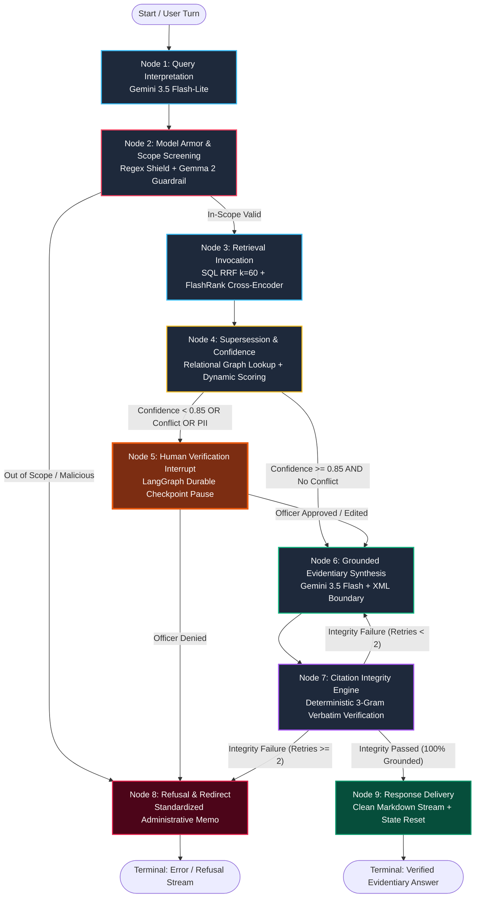

# PramanAI: Master System Architecture Document
## Autonomous Evidentiary GovTech Agent Fleet with Multimodal Vision Grounding
### Google "All Things Agentic" Hackathon — Track 3: The Fortified Enterprise Fleet

---

## 1. Executive Architecture Summary & Track 3 Fortification

**PramanAI** (प्रमाण AI) is an autonomous, evidentiary GovTech agent fleet designed for state government secretariats and public administration. In state governance, officers make high-stakes regulatory decisions grounded in decades of Government Orders (GOs / शासनादेश), statutory rules, notifications, and gazette amendments. These documents exist primarily as physical paper archives, degraded scans (100–300 DPI), legacy font-encoded PDFs (KrutiDev, Shree-Dev, Chanakya), and complex financial tables.

PramanAI solves the fundamental barrier to AI adoption in governance: **hallucination and evidentiary invalidity**. While standard LLM retrieval engines generate plausible-sounding summaries, PramanAI enforces a strict mathematical and procedural contract:
- **100% Verbatim Evidentiary Grounding:** Every factual assertion, monetary figure, and date must be directly backed by a certified excerpt from an active Government Order.
- **Automated Temporal Lineage & Supersession Resolution:** The agent actively determines whether an indexed GO remains active, has been amended, or was superseded by later orders across multi-decade chains.
- **Human-in-the-Loop (HITL) Secretariat Pausing:** The system deterministically suspends execution whenever ambiguity, conflicting provisions, personal data (DPDP Act 2023), or confidence drops below $0.85$.

```
+---------------------------------------------------------------------------------------------------+
|                                      PRAMAN-AI ENTERPRISE FLEET                                   |
|                                                                                                   |
|  +--------------------------------+   +---------------------------------+   +------------------+  |
|  |  Enterprise Agent Registry     |   |   Relational Memory Bank        |   | Google Cloud Run |  |
|  |  - Forest Department Desk      |   |   - PostgreSQL 16 + pgvector    |   | - asia-south1    |  |
|  |  - Finance & Treasury Desk     |   |   - supersession_graph          |   | - FastAPI Server |  |
|  |  - Personnel & Vigilance Desk  |   |   - AsyncPostgresSaver (Checkp) |   | - Auto-scaling   |  |
|  |  - ITDA System Administration  |   |   - SQL RRF Hybrid Search (k=60)|   | - GCS Storage    |  |
|  +--------------------------------+   +---------------------------------+   +------------------+  |
|                                                                                                   |
|  +---------------------------------------------------------------------------------------------+  |
|  | 9-Node Deterministic LangGraph StateGraph Topology                                           |  |
|  | [1. Query Interp] -> [2. Model Armor] -> [3. Hybrid RRF] -> [4. Supersession]                |  |
|  |                                                                     |                          |  |
|  | [9. Response Stream] <- [7. 3-Gram Integrity] <- [6. Grounded Synth] <- [5. HITL Interrupt]   |  |
|  |         |                                              ^                                       |  |
|  |         v                                              | (Max 2 Citation Retries)              |  |
|  | [8. Refusal / Redirect (Terminal)] --------------------+                                       |  |
|  +---------------------------------------------------------------------------------------------+  |
+---------------------------------------------------------------------------------------------------+
```

### The 4 Pillars of the Fortified Enterprise Fleet (Track 3)

| Pillar | Architectural Implementation | Enterprise Governance Value |
| :--- | :--- | :--- |
| **1. Enterprise Agent Registry & RBAC** | 4-Persona Secretariat Agent Fleet with cryptographic JWT auth (HS256) and departmental claim boundaries (`Forest`, `Finance`, `Personnel`, `ITDA Admin`). | Prevents cross-department data leakage; restricts high-privilege circulars to authorized secretariats. |
| **2. Memory Bank & Temporal Lineage** | Relational `supersession_graph` schema in PostgreSQL 16 with transitive closure traversal, combined with LangGraph `AsyncPostgresSaver` checkpointer. | Prevents officers from acting on obsolete/superseded orders issued in 2004 when a 2018 amendment exists. |
| **3. Gemma 2 Model Armor & Security Shield** | 2-tier defensive gateway combining deterministic regex filtering with Google Gemma 2 (`gemma-2-2b-it`) / Gemini Model Armor semantic guardrail. | Blocks prompt injection, jailbreaks, system prompt exfiltration, and out-of-scope administrative actions at sub-second latency. |
| **4. OpenTelemetry GenAI Observability** | OpenTelemetry GenAI Semantic Conventions (`invoke_agent` $\rightarrow$ `chat` $\rightarrow$ `retrieval` $\rightarrow$ `execute_tool`) exported to self-hosted Langfuse. | Provides immutable audit logs, token latency metrics, confidence drift tracking, and officer feedback scoring. |

---

## 2. Deterministic 9-Node LangGraph StateGraph Topology

PramanAI is orchestrated as a cyclical, bounded finite-state machine using **LangGraph**. Unlike uncontrolled autonomous loops or open-ended ReAct agents that wander and hallucinate, every node in PramanAI has a single, auditable cognitive responsibility with strict pre-conditions, post-conditions, and transition invariants.



### Node-by-Node Operational Specifications

#### Node 1: Query Interpretation (`node1_query_interpretation`)
- **Foundation Model:** Google Gemini 3.5 Flash-Lite (`gemini-3.5-flash-lite`), $\text{temperature}=0.0$.
- **Function:** Normalizes mixed Devanagari Hindi, English, and Hinglish administrative queries into canonical search queries. Extracts explicit structured metadata filters (`department`, `year_range`, `policy_category`, `go_number`).
- **Structured Output:** `QueryInterpretation` Pydantic V2 schema.
- **Pre-Condition:** Authenticated session initialized with immutable `officer_context`.
- **Post-Condition:** `query_text`, `query_language`, and `query_filters` updated via `last_write_wins_reducer`.

#### Node 2: Model Armor & Scope Gate (`node2_scope_screening`)
- **Defense Architecture:** 3-Tier Short-Circuit Gate:
  1. *Tier 1 (Deterministic Regex Injection Shield):* Synchronous sub-millisecond screening for jailbreak triggers, developer mode exploits, instruction overrides, and SQL injection tokens.
  2. *Tier 2 (Gemma 2 Model Armor Guardrail):* Semantic guardrail call using `gemma-2-2b-it` / Gemini Model Armor to detect covert adversarial payloads.
  3. *Tier 3 (Structured Administrative Scope Classification):* Evaluates query against strict GovTech boundaries. Automatically rejects queries requesting:
     - Financial disbursements or treasury payment authorizations.
     - Citizen grievance ticketing or individual dispute arbitration.
     - Autonomous executive order drafting.
     - Subjective political or policy opinions.
- **Routing Edge:** If `in_scope == False` or security violation detected $\rightarrow$ Route to **Node 8** (`graceful_refusal = True`). Else $\rightarrow$ Route to **Node 3**.

#### Node 3: Retrieval Invocation (`node3_retrieval_invocation`)
- **Engine:** PostgreSQL 16 `pgvector` Hybrid Search + FlashRank Cross-Encoder reranker.
- **Bilingual Taxonomy Expansion:** Automatically expands department queries (e.g., `'Forest'` $\rightarrow$ `['वन', 'पर्यावरण', 'forest', 'wildlife']`) using `src/utils/dept_mapper.py` and executes SQL `ILIKE ANY(%s::text[])` filtering with anti-punting fallback.
- **SQL Reciprocal Rank Fusion ($k=60$):**
  $$\text{RRF\_Score}(d) = \frac{0.6}{60 + \text{Rank}_{\text{dense}}(d)} + \frac{0.4}{60 + \text{Rank}_{\text{sparse}}(d)}$$
- **Neural Cross-Encoder Reranking:** Top candidate chunks from SQL RRF are scored using `FlashRank` (`ms-marco-MiniLM-L-12-v2`), slicing the top-8 highest-scoring narrative and tabular passages.
- **Post-Condition:** `retrieved_passages` populated via `replace_on_new_turn_reducer`.

#### Node 4: Supersession & Composite Confidence (`node4_supersession_confidence`)
- **Engine:** Relational `supersession_graph` lookup combined with multi-factor confidence scoring.
- **Dynamic Confidence Formula:**
  $$\text{Confidence} = 0.50 \cdot S_{\text{cross}} + 0.30 \cdot \Delta S + 0.20 \cdot \text{Lexical}$$
  *Where $S_{\text{cross}}$ is normalized cross-encoder score, $\Delta S$ is relevance margin ($S_1 - S_2$), and $\text{Lexical}$ is token overlap ratio.*
- **Fast-Path Elevation:** If a single authoritative GO is retrieved with relevance $\ge 0.35$ and verified `CURRENT_ACTIVE` status in `supersession_graph`, score is elevated to $\ge 0.92$.
- **Routing Invariant:**
  $$\text{Target} = \begin{cases} \text{Node 5 (Human Verification Interrupt)}, & \text{if } \text{Confidence} < 0.85 \lor \text{has\_conflict} = \text{True} \lor \text{PII} = \text{True} \\ \text{Node 6 (Grounded Evidentiary Synthesis)}, & \text{otherwise} \end{cases}$$

#### Node 5: Human Verification Interrupt (`node5_human_verification`)
- **Engine:** LangGraph `interrupt()` primitive with PostgreSQL checkpoint persistence.
- **Operation:** Suspends execution graph. Emits `data-approval-required` SSE event containing conflicting GO numbers, confidence breakdown, and PII alert.
- **Officer Resumption Contract:** Accepts signed cryptographic payload:
  - `action: "approve"` $\rightarrow$ Resumes execution to Node 6.
  - `action: "approve_with_edit"` (with `resolved_go_number`) $\rightarrow$ Overwrites active citation context and resumes to Node 6.
  - `action: "deny"` $\rightarrow$ Aborts to Node 8.

#### Node 6: Grounded Evidentiary Synthesis (`node6_grounded_synthesis`)
- **Foundation Model:** Google Gemini 3.5 Flash (`gemini-3.5-flash`), $\text{temperature}=0.0$, timeout $= 15.0\text{s}$.
- **Prompt Isolation Architecture:** Retrieved document text is injected strictly inside `<retrieved_document_context>` XML tags. The system prompt enforces zero external speculation:
  > *"State ONLY what is explicitly codified in the excerpt. Every substantive sentence must terminate with a citation bracket `[GO-Number, Page X]`. If information is missing from the context, state silence over guessing."*
- **Page Index Alignment:** Sub-function `_find_best_matching_passage()` resolves citations to certified 1-based PDF page numbers and computes visual bounding boxes.

#### Node 7: Citation Integrity Engine (`node7_citation_integrity`)
- **Engine:** Deterministic, sub-millisecond Python sliding-window 3-gram character recall algorithm.
- **Verification Rule:** Every claim and numeric premise in `answer_markdown` is extracted and checked against raw passage excerpts:
  $$\text{Recall}_{3\text{gram}} = \frac{|\text{Grams}(\text{Claim}) \cap \text{Grams}(\text{Source})|}{|\text{Grams}(\text{Claim})|} \ge 0.75$$
- **Bounded Cycle Cap:** If ungrounded assertions are detected, the graph loops back to Node 6 for re-synthesis with an explicit citation failure prompt. Bounded to a strict maximum of `MAX_CITATION_RETRIES = 2`. On the 3rd failure, routes to Node 8 Refusal.

#### Node 8: Graceful Refusal & Redirect (`node8_refusal_redirect`)
- **Function:** Terminal node for out-of-scope requests, ungrounded queries, or denied approvals.
- **Standardized Sovereign Memorandum:** Formats refusal in official bilingual secretariat style, clearly stating the administrative limitation, policy boundary, or lack of indexed records without hallucinating alternative legal interpretations.

#### Node 9: Response Delivery (`node9_response_delivery`)
- **Function:** Terminal delivery node. Executes `clean_ui_markdown()` to strip internal parser artifacts, streams clean markdown tokens to the SSE pipeline, and emits final state events.

---

## 3. 17-Field Type-Safe StateSchema & Reducer Contract

PramanAI state management is governed by a central, immutable Pydantic V2 `StateSchema` registered in `src/state/schema.py`. State fields are strictly updated through declared mathematical reducers (`src/state/reducers.py`) — direct in-place mutation outside declared reducers is impossible.

| Field Name | Type Signature | Reducer Function | Lifecycle & Semantic Invariant |
| :--- | :--- | :--- | :--- |
| `session_id` | `str` | `immutable_reducer` | Invariant UUID generated at login; immutable across turns. |
| `officer_context` | `OfficerContext` | `immutable_reducer` | Officer department and authorization scope derived from JWT. |
| `query_text` | `str` | `last_write_wins_reducer` | Raw user query from current turn. |
| `query_language` | `Literal["hi", "en", "hinglish"]` | `last_write_wins_reducer` | Detected linguistic mode from Node 1. |
| `query_filters` | `QueryFilters` | `last_write_wins_reducer` | Extracted department, date, and GO filters. |
| `message_history` | `list[Message]` | `append_only_reducer` | Append-only conversation history for multi-turn sessions. |
| `retrieved_passages` | `list[PassageMatch]` | `replace_on_new_turn_reducer` | Top candidate chunks retrieved for the current turn. |
| `candidate_citations` | `list[Citation]` | `merge_by_citation_key_reducer` | Deduplicated citations merged across multi-step retrieval. |
| `confidence_score` | `float` ($[0.0, 1.0]$) | `last_write_wins_reducer` | Mathematical grounding confidence score from Node 4. |
| `supersession_status`| `Literal["CURRENT_ACTIVE", "AMENDED", "SUPERSEDED", "UNKNOWN"]` | `last_write_wins_reducer` | Lineage status of governing order. |
| `conflict_flags` | `list[ConflictRecord]` | `append_only_reducer` | Detected contradictory provisions between GOs. |
| `human_verification` | `Optional[ApprovalState]` | `last_write_wins_reducer` | Recorded officer HITL decision payload. |
| `answer_markdown` | `Optional[str]` | `last_write_wins_reducer` | Synthesized grounded answer text. |
| `citations` | `list[Citation]` | `last_write_wins_reducer` | Final validated citation list backing the answer. |
| `graceful_refusal` | `bool` | `last_write_wins_reducer` | Flag indicating refusal route activation. |
| `error_logs` | `list[ErrorRecord]` | `append_only_reducer` | Immutable audit log of execution errors and safety events. |
| `config` | `RuntimeConfig` | `immutable_reducer` | Session timeouts, retry caps, and safety thresholds. |

---

## 4. 5-Layer Defense-in-Depth Document Ingestion & Vision Pipeline

Legacy government documents in India present severe OCR challenges: KrutiDev-010 8-bit legacy font encodings, bleed-through ink on low-GSM paper, circular administrative rubber stamps, and complex multi-column budget tables. PramanAI deploys a 5-layer ingestion pipeline:

```
[Legacy Scanned / Typed PDF]
            |
            v
+-------------------------------------------------------------------------------+
| Stage 1: Triage & Font Engine                                                 |
| - Text layer extraction & Shannon entropy calculation                         |
| - Token-Aware KrutiDev-010 / Shree-Dev / Chanakya -> Unicode Devanagari conv  |
| - Digital vector vs. Scanned raster triage                                    |
+-------------------------------------------------------------------------------+
            |
            v
+-------------------------------------------------------------------------------+
| Stage 2: 300+ DPI Vision & Preprocessing                                      |
| - 300 DPI high-resolution rasterization via PyMuPDF                           |
| - Non-destructive HSV rubber stamp / watermark suppression                    |
| - Sauvola local adaptive binarization & contrast enhancement                 |
+-------------------------------------------------------------------------------+
            |
            v
+-------------------------------------------------------------------------------+
| Stage 3: Multimodal VLM Extraction (Gemini 3.5 Flash Vision)                  |
| - Zero-shot multimodal layout & table parsing                                 |
| - Extraction into structured GitHub-Flavored Markdown (GFM) tables            |
| - Direct extraction of normalized bounding boxes [ymin, xmin, ymax, xmax]    |
+-------------------------------------------------------------------------------+
            |
            v
+-------------------------------------------------------------------------------+
| Stage 4: Devanagari Normalizer                                                |
| - Unicode NFC normalization                                                   |
| - Disambiguation of U+0970 (Devanagari Abbreviation Sign) vs U+0966 (Zero)   |
| - Canonical Nuqta placement and Halant-consonant cluster reordering          |
+-------------------------------------------------------------------------------+
            |
            v
+-------------------------------------------------------------------------------+
| Stage 5: 2D Constraint Math Validator                                         |
| - Row-wise financial sum validation: Sum(Rows) == Total                       |
| - Currency unit multiplier scaling (Lakhs, Crores, Thousand)                  |
| - Rejection of ungrounded or corrupted numerical tables                       |
+-------------------------------------------------------------------------------+
```

---

## 5. Evidentiary Visual Grounding & Document Serving Engine

To establish zero doubt in court or administrative audits, PramanAI implements exact visual grounding overlays over original PDF pages.

### Coordinate Normalization System
Bounding boxes are generated and stored in a universal normalized float coordinate system:
$$[ymin, xmin, ymax, xmax] \in [0.0, 1.0]$$

1. **PDF Engine (PyMuPDF):** 72 DPI PDF point coordinates $(x_0, y_0, x_1, y_1)$ are normalized against page dimensions $(W_{\text{pts}}, H_{\text{pts}})$:
   $$xmin = \frac{x_0}{W_{\text{pts}}}, \quad ymin = \frac{y_0}{H_{\text{pts}}}, \quad xmax = \frac{x_1}{W_{\text{pts}}}, \quad ymax = \frac{y_1}{H_{\text{pts}}}$$
2. **Frontend Overlay (Next.js Canvas):** In `DocumentViewer.tsx`, coordinates are scaled dynamically to the rendered DOM element:
   $$\text{left} = xmin \cdot 100\%, \quad \text{top} = ymin \cdot 100\%, \quad \text{width} = (xmax - xmin) \cdot 100\%, \quad \text{height} = (ymax - ymin) \cdot 100\%$$
3. **On-the-Fly Page Rendering:** PyMuPDF renders 150 DPI crisp raster pages via `/api/documents/{go_number}/pages/{page_number}`, with server-side disk caching in `data/page_cache/`.

```
+--------------------------------------------------------------------------+
|  UTTARAKHAND GOVERNMENT GAZETTE - GO No: 1542/XXVIII/2018                |
|                                                                          |
|  1. Mineral royalty rates for transit across state borders:              |
|  +--------------------------------------------------------------------+  |
|  | [!] YELLOW HIGHLIGHT OVERLAY (CSS: rgba(250, 204, 21, 0.35))      |  |
|  |     "उपखनिजों पर रायल्टी की दरें ₹120 प्रति घनमीटर निर्धारित की    |  |
|  |      जाती हैं, जो दिनांक 01 अप्रैल 2018 से प्रभावी होंगी।"        |  |
|  +--------------------------------------------------------------------+  |
|                                                                          |
|  2. Transit pass validity shall not exceed 15 calendar days.             |
+--------------------------------------------------------------------------+
```

---

## 6. Enterprise Features & Secretariat Governance

### 1. Official Secretariat Note-Sheet (शासकीय टिप्पणी)
PramanAI includes a 1-click Secretariat Note-Sheet generator that transforms evidentiary responses into official state government format:
- **Bilingual Secretariat Header:** "उत्तराखण्ड शासन / Government of Uttarakhand — ई-टिप्पणी (E-Note Sheet)".
- **Numbered Legal Paragraphs:** Formats answers into structured administrative clauses with official terminology.
- **Table of Authorities:** Summarizes every cited GO, date, issuing department, and certified verbatim extract.
- **Print & PDF Export:** Dedicated `@media print` CSS stylesheet formatting documents into standard A4 legal margins with official signature blocks.

### 2. Chronological Precedent Timeline
Visualizes multi-decade regulatory chains directly in the user interface:
- `CURRENT ACTIVE`: The governing, unrepealed circular currently in force.
- `PREVIOUS ORDER`: Earlier baseline rules that were subsequently modified.
- `SUPERSEDED`: Ineffective, repealed provisions flagged with cross-reference warnings.

### 3. Sovereign JWT Authentication & Multi-Tenant Session Isolation
- **Authentication:** HS256 JWT tokens with bcrypt password hashing.
- **Session Isolation:** Each session is scoped to an officer's UUID and departmental boundary.
- **Persistent Chat History:** Full conversational state and checkpoint memory stored in PostgreSQL.

---

## 7. Google Cloud Platform Production Architecture

PramanAI is engineered for serverless deployment on Google Cloud Platform:

```
[State Officer / Web Client]
            |
            | HTTPS (TLS 1.3) / SSE Streaming
            v
+-------------------------------------------------------------------------------+
| Google Cloud Run (Region: asia-south1 / Mumbai)                               |
| Container: gcr.io/pramanai-prod/backend:latest                                |
| - High-performance FastAPI ASGI Server (Uvicorn)                              |
| - Auto-scaling: Min 0 instances, Max 3 instances                              |
| - Concurrency: 80 requests / container instance                               |
| - In-Memory Cross-Encoder Cache & PyMuPDF Rendering Engine                     |
+-------------------------------------------------------------------------------+
         |                                                 |
         | Google Cloud Storage SDK                        | google-genai SDK / HTTPS
         v                                                 v
+------------------------------------+   +------------------------------------+
| Google Cloud Storage (GCS)         |   | Google Gemini Enterprise Suite     |
| Bucket: gs://pramanai-artifacts-...|   | - Gemini 3.5 Flash (Synthesis & VLM)|
| - PDF Archive Caching              |   | - Gemini 3.5 Flash-Lite (Fast-Path)|
| - High-Res Page Raster Cache       |   | - Gemma 2 (Model Armor Guardrail)  |
+------------------------------------+   +------------------------------------+
         |
         | Async Connection Pooling (psycopg_pool)
         v
+-------------------------------------------------------------------------------+
| PostgreSQL 16 + pgvector Database Instance                                    |
| - pgvector HNSW Indexing (vector_cosine_ops)                                  |
| - supersession_graph Relational Lineage Table                                 |
| - LangGraph AsyncPostgresSaver Checkpoint Store                               |
+-------------------------------------------------------------------------------+
```

### OpenTelemetry GenAI Suite & Langfuse Scoring
- **OTel Semantic Conventions:** Tracing spans follow `gen_ai.system = "google"`, tracking prompt tokens, completion tokens, model parameters, and node execution latencies.
- **DPDP Act 2023 Compliance:** Officer queries and document contexts pass through PII redaction filters prior to telemetry export.
- **Langfuse Integration:** Officer feedback (thumbs up/down, corrections) is tied directly to Langfuse trace IDs for continuous grounding evaluation.

---

## 8. Architectural Invariants & Anti-Patterns (Enforced)

1. **No External Cloud APIs:** Non-Google proprietary cloud LLM APIs (`anthropic`, `openai`) are strictly prohibited.
2. **No Unbounded Planning Loops:** Open-ended autonomous execution loops are replaced with the deterministic 9-node LangGraph finite state machine.
3. **No Unsanitized Model Context:** Retrieved document chunks must always be injected inside `<retrieved_document_context>` XML blocks to prevent prompt injection.
4. **No Direct State Mutation:** All mutations to `StateSchema` must proceed through declared mathematical reducers.
5. **No Speculative Answers:** Empty or low-relevance retrieval must route to low confidence ($<0.85$) and Node 8 Refusal — never a fabricated answer.

---

*Document Author:* Principal AI Systems Architect, PramanAI GovTech Fleet  
*Target Track:* Google "All Things Agentic" Hackathon — Track 3: The Fortified Enterprise Fleet  
*Status:* Authoritative / Production-Ready Reference
